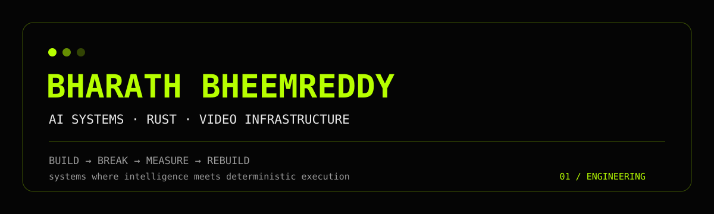

<div align="center">



### AI systems • Rust • video infrastructure • autonomous engineering

<p><a href="https://github.com/desukab"></a> <a href="https://github.com/desukab/rust-streaming-systems-lab"></a> <a href="https://github.com/desukab/selektyt"></a></p>

</div>

---

## whoami

I'm **Bharath Bheemreddy** — a self-taught engineer who likes taking ambiguous problems, learning whatever the system demands, and turning the idea into working software.

My current work sits at the intersection of:
- **AI engineering** — LLMs, agents, multimodal reasoning, editorial intelligence
- **Systems engineering** — Rust, async execution, concurrency, partitioning, recovery
- **Media infrastructure** — FFmpeg, video analysis, timelines, captions, interchange
- **Applied product engineering** — architecture → implementation → verification

> **I care less about collecting frameworks and more about understanding the system underneath them.**

---

## currently building

### ⚡ SeleKyT
**AI-native editorial intelligence for long-form video.**

Raw footage + editorial intent → understanding → story/evidence structure → edit decisions → editable timeline.

The interesting problem isn't generating another clip.

It's teaching software to understand **what the footage means, why a moment belongs in an edit, and how to represent that decision deterministically**.

`Python` `Rust` `LLM/VLM` `FFmpeg` `Computer Vision` `FCPXML` `EDL` `Azure`

> Private while actively developing.

### 🦀 Rust Streaming Systems Lab
A deliberately serious systems-engineering project exploring continuously running, high-throughput service problems:

`Tokio` · bounded queues · backpressure · partitioned workers · ordering · idempotency · stale-event rejection · materialized state · secondary indexes · durability · checkpoints · recovery · metrics · benchmarks

**The goal:** understand engineering trade-offs, not just make a demo compile.

→ **[Explore the repository](https://github.com/desukab/rust-streaming-systems-lab)**

---

## selected work

| Project | What it demonstrates |
|---|---|
| **SeleKyT** | AI editorial reasoning, media pipelines, decision graphs, canonical timelines |
| **Rust Streaming Systems Lab** | Async Rust, concurrency, state, recovery, backpressure, testing |
| **Dasha News** | Full-stack product engineering, news ingestion, mobile/backend systems |
| **Visual Editor** | Interactive media tooling and frontend engineering |
| **High-throughput Async Scraper** | Async I/O, concurrency and data pipelines |
| **Clipbaa** | Video processing and automated media workflows |

→ **[See all public repositories](https://github.com/desukab?tab=repositories)**

---

## stack

### Systems
`Rust` `Tokio` `Python` `Linux` `Async I/O` `Concurrency` `Networking`

### AI
`LLMs` `AI Agents` `Multimodal AI` `Computer Vision` `NLP` `Retrieval`

### Media
`FFmpeg` `OpenCV` `Video Processing` `Transcription` `Timelines` `FCPXML` `EDL`

### Infrastructure
`Azure` `Git` `GitHub Actions` `CLI tooling` `Testing` `Benchmarking`

### Data / application
`PostgreSQL` `Redis` `WebSockets` `REST APIs` `Flutter` `TypeScript`

---

## engineering style

```text
                    PROBLEM
                       ↓
                   UNDERSTAND
                       ↓
              DESIGN THE INVARIANTS
                       ↓
                     BUILD
                       ↓
                 BREAK THE SYSTEM
                       ↓
                    MEASURE
                       ↓
                    REBUILD
```

I like systems where **failure modes, invariants, provenance and trade-offs are explicit**.

A feature isn't finished because the happy path works.

---

## what I'm learning

I deliberately build outside my existing comfort zone.

Recent focus:
- distributed / streaming-system design
- Rust ownership and concurrency
- async execution with Tokio
- partitioned state and ordering semantics
- durable recovery and checkpoint design
- AI-assisted software architecture
- multimodal video understanding
- professional media interchange
- performance measurement and failure testing

That learning loop is part of the portfolio.

---

## principles

**01 — Understand the constraint before choosing the tool.**

**02 — Prefer explicit invariants over cleverness.**

**03 — Make failure observable.**

**04 — Measure performance instead of guessing.**

**05 — Keep AI reasoning separate from deterministic execution.**

**06 — Don't claim production experience I don't have. Build evidence instead.**

**07 — Ship, inspect, improve.**

<div align="center">

### BUILD → BREAK → MEASURE → REBUILD

<sub>Independent engineer • AI systems • Rust • media infrastructure</sub>

<br />

**Open to interesting engineering problems.**

</div>